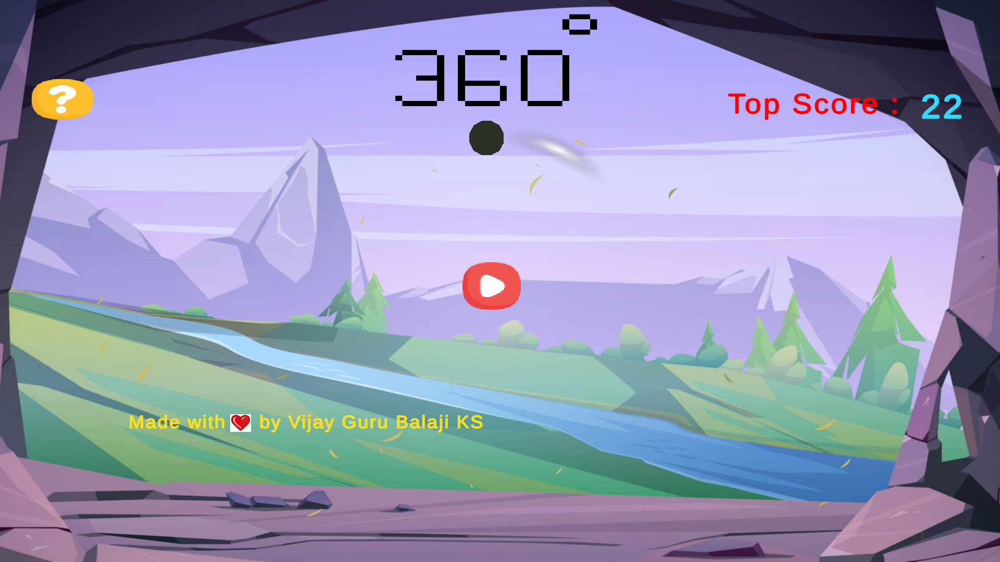
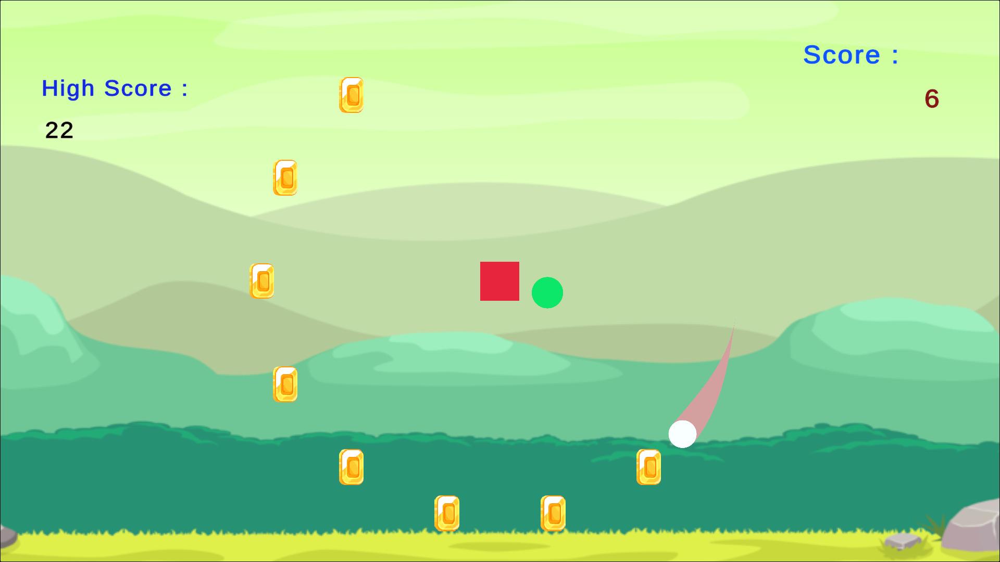
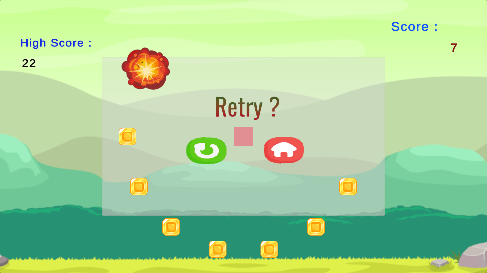

# Revolve(360)

## Do Check out my game in 👇👇
https://vijay007.itch.io/360-game

## Description

Revolve(360) is a 2D Unity game where the player maneuvers in a circular path, evading incoming bullets or obstacles while collecting coins to achieve a high score.

## Features

- **Circular Path Gameplay:** Unique gameplay where the player revolves in a circular path.
- **Bullet Evading:** Dodge incoming bullets or obstacles to survive.
- **Coin Collection:** Gather coins along the circular path to increase your high score.
- **Scoring System:** Compete for the highest score by avoiding obstacles and collecting coins.

## How to Play

1. Clone the repository to your local machine.
2. Open the project in Unity.
3. Navigate to the main scene and run the game.
4. Use controls to move the player in the circular path, avoiding bullets.
5. Collect coins to increase your high score.
6. Survive as long as possible to achieve the highest score.

## Controls

- **SpaceBar Button:** To change the direction of the player in clockwise and anticlockwise direction.

## Scoring

- Score is based on the number of coins collected.

## Screenshots

## Contributing

Feel free to contribute to the project by opening issues or creating pull requests. Follow the guidelines outlined in [CONTRIBUTING.md].

## License

This project is licensed under the [MIT License] - see the [LICENSE.md] file for details.
